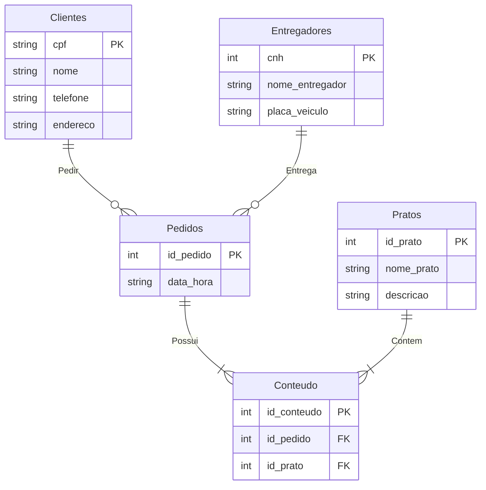

```mermaid
erDiagram

Clientes{
    string cpf PK
    string nome
    string telefone
    string endereco
}

Pratos{
    int id_prato PK
    string nome_prato
    string descricao
}

Entregadores{
    int cnh PK
    string nome_entregador
    string placa_veiculo
}

Pedidos{
    int id_pedido PK
    string data_hora
}


Conteudo{
    int id_conteudo PK
    int id_pedido FK
    int id_prato FK
}

Clientes || -- o{ Pedidos : Pedir
Entregadores || -- o{ Pedidos: Entrega


Pedidos || -- |{ Conteudo : Possui
Pratos || -- |{ Conteudo : Contem


```