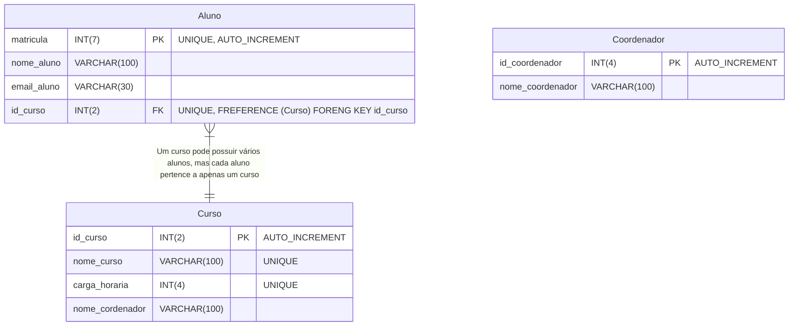
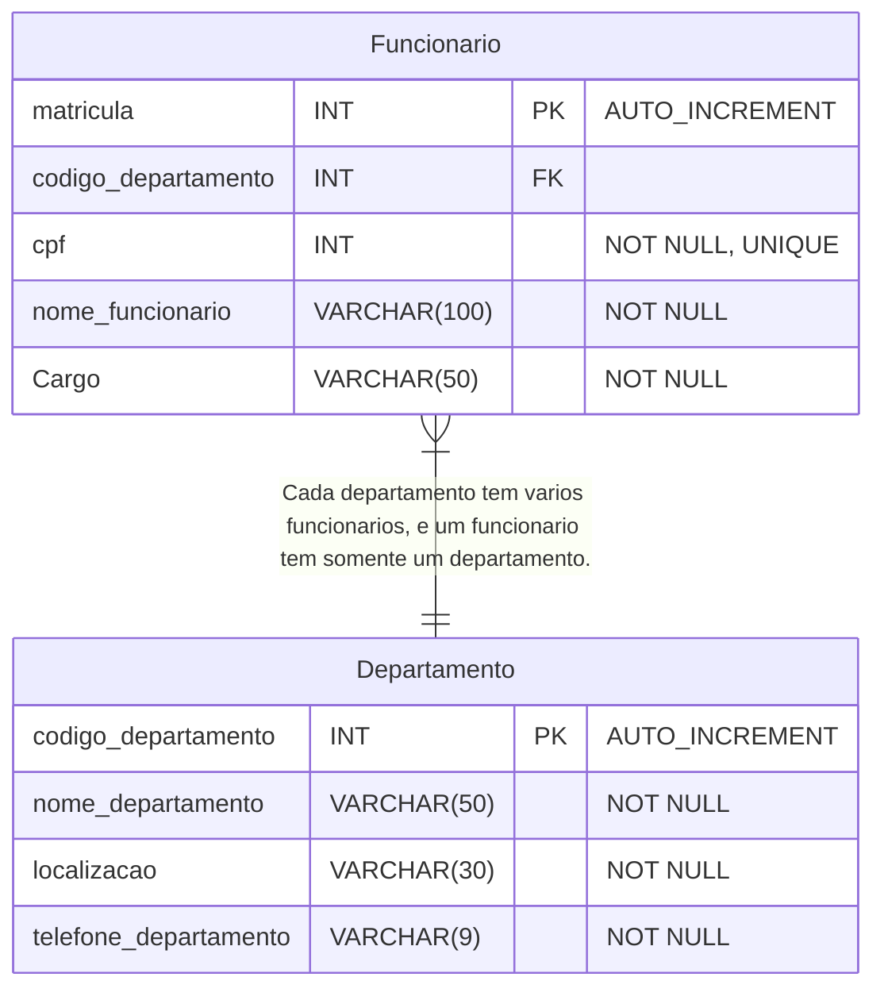

# Questão Banco de dados

## Questão 1

```mermaid
erDiagram

Aluno {

    matricula INT(7) PK "UNIQUE, AUTO_INCREMENT"
    nome_aluno VARCHAR(100)
    email_aluno VARCHAR(30)

    id_curso INT(2) FK "UNIQUE, FREFERENCE (Curso) FORENG KEY id_curso"
    
}

Curso {

    id_curso INT(2) PK "AUTO_INCREMENT"
    nome_curso VARCHAR(100) "UNIQUE"
    carga_horaria INT(4) "UNIQUE"
    nome_cordenador VARCHAR(100)

}


Coordenador{

    id_coordenador INT(4) PK "AUTO_INCREMENT"
    nome_coordenador VARCHAR(100)

}


Aluno }| -- || Curso : "Um curso pode possuir vários alunos, mas cada aluno pertence a apenas um curso"
```

## Questão 2

```mermaid
erDiagram

Funcionario {

    matricula INT PK "AUTO_INCREMENT"
    codigo_departamento INT FK 
    cpf INT "NOT NULL, UNIQUE"
    nome_funcionario VARCHAR(100) "NOT NULL"
    Cargo VARCHAR(50) "NOT NULL"

}

Departamento {

    codigo_departamento INT PK "AUTO_INCREMENT"
    nome_departamento VARCHAR(50) "NOT NULL"
    localizacao VARCHAR(30) "NOT NULL"
    telefone_departamento VARCHAR(9) "NOT NULL"

}

Funcionario }| -- || Departamento : "Cada departamento tem varios funcionarios, e um funcionario tem somente um departamento."
```