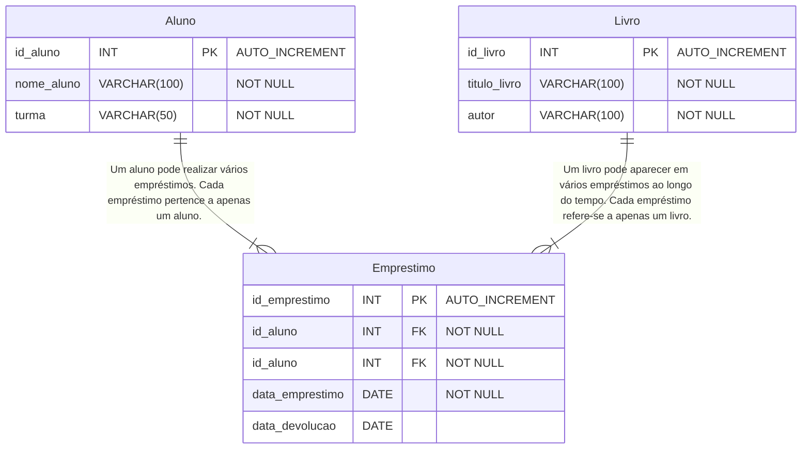

# Atividade III: Normalização, Modelagem Lógica e Implementação em SQL

Uma escola deseja organizar as informações sobre os empréstimos de livros realizados pelos estudantes. Atualmente, os dados são armazenados em
uma única tabela. Normalize-o.


```html


```

## Diagrama DER

