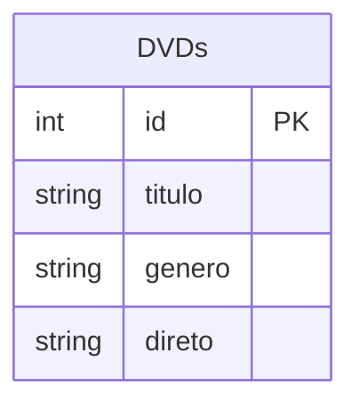

# Anotações Banco de Dados

O seguinte modulo tem a função de guardar scripts gênericos feitos em sala de aula, será um banco para scripts e confecção de exercícios relacionados a máteria de banco de dados.

# Notas

- Dominio - Regras de Negocios

- Sistema de gerenciamento de banco de dados (SGBD)
    - Permite com que usuários simultaneos sejam capazes de consultar dados.
    - Bloquea o acesso de pessoas não altorazidas.

- Modelagem: Definir Estrutura, Definir Organização e Definir Relação entre as abstrações.
    - Tipos de Modelagem: Modelo Conceitual, Modelo Lógico e Modelo Físico

## Exemplo da Banco de dados

### Contexto:

Imagine uma coleção de DVDs. Como seria organizada a coleção?

> Desenvolvimento do Entendimento da Probemática:
> - Por nome, por título, por ano?
> - Como vou localizar os meus DVDs? 
>   - Por nome, por título, por ano ou de todas formas?


### Tabela DVD


### Forma Organizacional

- Filtradas por Gênero
    - Cada gênero ordenado por ordem alfabética.
- Cada seção

> Nota: Cada DVD seria separado por gênero e cada uma dessas separações seria organizada por ordem alfabetica.

## Tipo de Relacionamentos - Relação de Cardinálidades e Simbologias

- 1 ou muitos para 1 ou muitos

    ```mermaid
    erDiagram

    AA {
        int id_a PK
        }

    BB {
        int id_b PK
    }

    AA }|--|{ BB : Relacionamento
    ```

