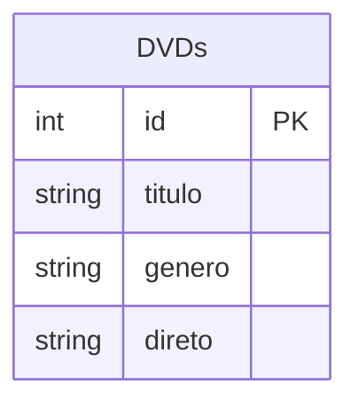
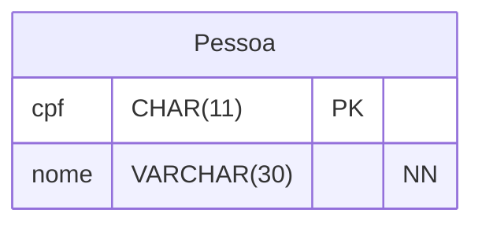
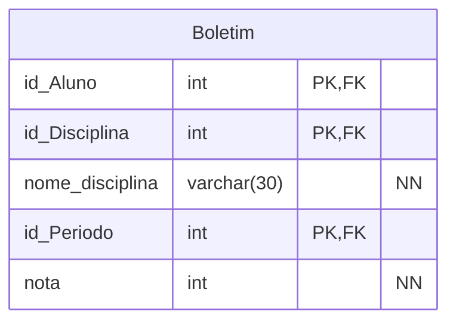
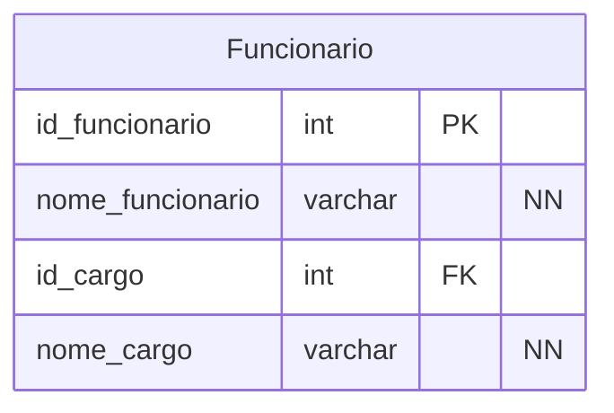

# Anotações Banco de Dados

O seguinte modulo tem a função de guardar scripts gênericos feitos em sala de aula, será um banco para scripts e confecção de exercícios relacionados a máteria de banco de dados.

# Notas

- Dominio - Regras de Negocios

- Sistema de gerenciamento de banco de dados (SGBD)
    - Permite com que usuários simultaneos sejam capazes de consultar dados.
    - Bloquea o acesso de pessoas não altorazidas.

- Modelagem: Definir Estrutura, Definir Organização e Definir Relação entre as abstrações.
    - Tipos de Modelagem: Modelo Conceitual, Modelo Lógico e Modelo Físico

## Exemplo da Banco de dados

### Contexto:

Imagine uma coleção de DVDs. Como seria organizada a coleção?

> Desenvolvimento do Entendimento da Probemática:
> - Por nome, por título, por ano?
> - Como vou localizar os meus DVDs? 
>   - Por nome, por título, por ano ou de todas formas?


### Tabela DVD


### Forma Organizacional

- Filtradas por Gênero
    - Cada gênero ordenado por ordem alfabética.
- Cada seção

> Nota: Cada DVD seria separado por gênero e cada uma dessas separações seria organizada por ordem alfabetica.

## Tipo de Relacionamentos - Relação de Cardinálidades e Simbologias

- 1 ou muitos para 1 ou muitos

    ```mermaid
    erDiagram

    AA {
        int id_a PK
        }

    BB {
        int id_b PK
    }

    AA }|--|{ BB : Relacionamento
    ```

## Anomalias no BD

Anomalias são comportamentos inconsistentes nos dados, isto é, tabelas com campos relacionados com disparidades entre si, além disso, temos casos de repetição.

## Formas normais

### Dependências Funcionais

Relacionamento entre dois atributos, por exemplo, um atributo qualquer tem uma dependencia funcional em chaves primarias. 



### Dependência Funcional Parcial

Uma dependência funcional ocorre quando os atributos não chave (atributos qualquer) não dependem de toda a chave primaria quando ela for composta.



### Dependência Funcional Transitiva

A dependência funcional transitiva ocorre quando um atributo não-chave depende de outro atributo que também não é chave primária, criando uma ligação indireta com a chave principal da tabela. Formalmente, se temos X → Y e Y → Z, dizemos que X determina Z de forma transitiva através de Y.



### Atributos Compostos

Um atributo composto é uma característica de uma entidade que pode ser dividida em partes menores. Cada parte menor forma um atributo simples (ou atômico). O exemplo mais comum é o endereço, que se divide em rua, número, bairro e cidade.

### Primera Forma Normal (1FN)

> A Primeira Forma Normal (1FN) exige que todos os atributos de uma tabela contenham apenas valores atômicos (únicos e indivisíveis), eliminando completamente grupos de repetição, colunas multivaloradas ou estruturas aninhadas, garantindo assim a integridade estrutural básica de uma relação em banco de dados.

***ATENTE-SE:*** A primeira forma normal se concentra em eliminar valores multivalorados, ou seja, eliminar o que causa repetição.

**Regras Principais da 1FN:**

> - Atomicidade dos dados: Cada célula da tabela deve possuir apenas um valor, sem listas, matrizes ou múltiplos dados agrupados em uma mesma linha e coluna
> - Sem grupos repetidos: Linhas ou colunas não devem repetir conjuntos de informações equivalentes (como telefone1, telefone2).
> - Uso de chave primária: A tabela precisa definir uma chave primária para assegurar a identificação única de cada linha.
> - Eliminação de atributos compostos: Campos que podem ser divididos em subpartes com significado próprio (como um endereço completo ou nome e sobrenome) devem ser separados em colunas distintas.

### Segunda Forma Normal

> A Segunda Forma Normal (2FN) exige que uma tabela esteja na Primeira Forma Normal (1FN) e que não existam dependências parciais. Isso significa que nenhum atributo não-chave pode depender de apenas uma parte de uma chave primária composta; todos devem depender da chave inteira

#### **Regras Principais da 2FN:**

> - Estar na 1FN: Os dados devem ser atômicos e possuir uma chave primária definida.
> - Sem dependência parcial: Atributos que não são chave não podem depender só de um pedaço da chave composta.
> - Chave simples: Se a chave primária tem apenas uma coluna, a tabela já está automaticamente na 2FN.

#### **Como Resolver Problemas na 2FN:**

> - Dividir tabelas: Separe as colunas que dependem só de uma parte da chave para uma nova tabela.
> - Criar chaves: O pedaço da chave que foi movido vira a chave da nova tabela e chave estrangeira na original.

### Conlusão

Um banco de dados mal projetado apresenta anomalias na inserção, consequentemente, haverá redundância e inconsistêncuas. A Normalização é processo de adequar o banco de dados.

## DDL - Data Definition Language (Linguagem de Definição de Dados)

```mysql

# Criar banco de dados
CREATE DATABASE db_vetpet;

# Criação do banco de dados.
# CREATE DATABASE vp_vetpet;


# Utilização do banco de dados.
USE vp_vetpet;


# Criação de uma tabela no banco de dados.
CREATE TABLE Tutor (

	id_tutor INT AUTO_INCREMENT PRIMARY KEY, # CONSTRAINTS - Regras do atributo ou restrições de um atributo.
    nome_tutor VARCHAR(130) NOT NULL,
    cpf_tutor CHAR(11) NOT NULL UNIQUE,
    email_tutor VARCHAR(30) NOT NULL,
    data_nasc_tutor DATE,
    telefone_tutor CHAR(11)
    
);

# Inserção de dados numa tabela.

	# Especificando a Tabela, a ordem e os atributos

INSERT INTO Tutor (
	nome_tutor,
    cpf_tutor,
    email_tutor,
    data_nasc_tutor
) VALUES 
    ("Irineu", "11111111111", "teste", "2123-12-13"),
    ("Irineu", "22222222222", "teste", "2123-12-13"),
    ("Irineu", "33333333333", "teste", "2123-12-13"),
    ("Irineu", "44444444444", "teste", "2123-12-13");

# Pesquisas Gerais.
SELECT * FROM TUTOR;

# Pesquisas com campos especificos.
SELECT cpf_tutor FROM TUTOR;


# Pesquisas com filtragem.
SELECT * FROM TUTOR
WHERE cpf_tutor = "11111111111";

# Alteração de dados.
UPDATE Tutor
SET email_tutor = "irineu"
WHERE id_tutor = 2;

# Alteração de multiplas instancias.
UPDATE Tutor
SET telefone_tutor = "12312312312"
WHERE id_tutor = 1 OR id_tutor = 2; # Em caso de UPDATE e DELETE só é permitido condicionantes com chave primária.

# Apaga todas as instâncias da tabela
TRUNCATE TABLE tutor;

# Excluir tabela
DROP TABLE Tutor;

#

```


```

# Criação do banco de dados.
# CREATE DATABASE vp_vetpet;


# Utilização do banco de dados.
USE vp_vetpet;


# Criação de uma tabela no banco de dados.
CREATE TABLE Tutor (

	id_tutor INT AUTO_INCREMENT PRIMARY KEY, # CONSTRAINTS - Regras do atributo ou restrições de um atributo.
    nome_tutor VARCHAR(130) NOT NULL,
    cpf_tutor CHAR(11) NOT NULL UNIQUE,
    email_tutor VARCHAR(30) NOT NULL,
    data_nasc_tutor DATE,
    telefone_tutor CHAR(11)
    
);

CREATE TABLE Pet (

	id_pet INT AUTO_INCREMENT PRIMARY KEY,
    
		id_tutor INT NOT NULL,
		FOREIGN KEY (id_tutor) REFERENCES Tutor(id_tutor),
    
    nome_pet VARCHAR(50) NOT NULL,
    
		id_tipo_pet INT NOT NULL,
        FOREIGN KEY (id_tipo_pet) REFERENCES Tipo_Pet (id_tipo_pet),
        
	data_nasc_pet DATE

);

	CREATE TABLE Tipo_Pet (
		
		id_tipo_pet INT AUTO_INCREMENT PRIMARY KEY,
		nome_tipo_pet VARCHAR(50) NOT NULL
		
	);

# Inserção de dados numa tabela.

	# Especificando a Tabela, a ordem e os atributos

INSERT INTO Tutor(
	nome_tutor,
    cpf_tutor,
    email_tutor,
    data_nasc_tutor,
    telefone_tutor
) VALUES 
    ("Irineu", "11111111111", "teste", "2123-12-13", "12312312312");
    
    
INSERT INTO Tipo_Pet(nome_tipo_pet)
VALUES ("Cachorro");
    
    
# Comando de Cruzamento de Tabelas INNER JOIN


```