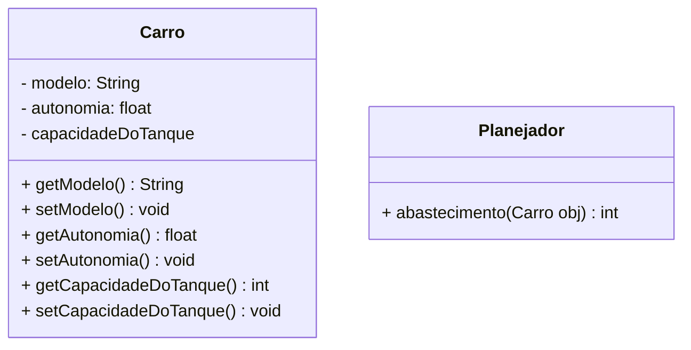

# Resolução - lista da semana 2, 4º questão.

Crie uma classe chamada Carro. Essa classe vai possuir os atributos chamado:modelo (String), autonomia (do tipo float) capacidade do tanque (inteiro). A autonomia de um carro consiste na quantidade de quilômetros que o carro consegue percorrer com um 1 litro de combustível. A capacidade do tanque consiste na quantidade de litros de combustível que cabem no tanque do carro. Respeite as convenções de nomenclatura e visibilidade que estudamos.

## Diagramas de classe

## Regras de Negócio

### Carro

- **'autonomia':** A autonomia de um carro consiste na quantidade de quilômetros que o carro consegue percorrer com um 1 litro de combustíve

- **'capacidadeDoTanque':** A capacidade do tanque consiste na quantidade de litros de combustível que cabem no tanque do carro.

### Planejador

- **'abastecimento()':** Este método retornará uma estimativa da quantidade de abastecimentos que o carro precisará fazer para chegar ao destino.